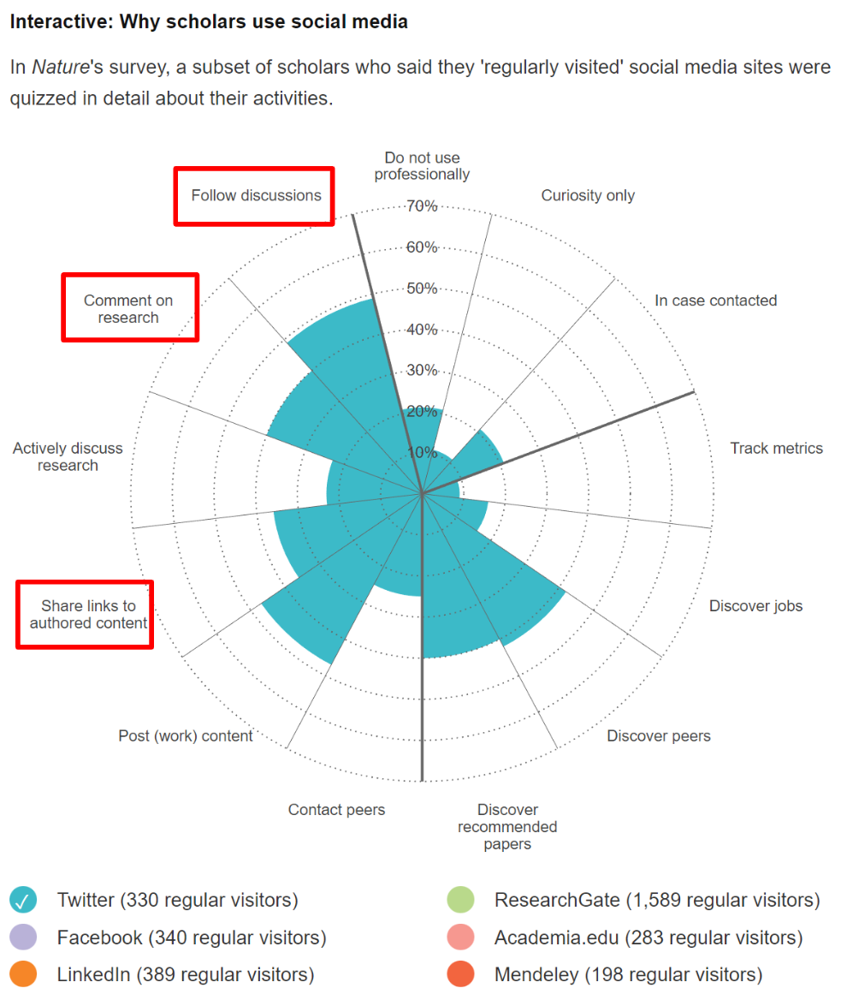

[:annotation-thread:]{}


::: abstract
This project adds reader "highlights" and social annotations to Living Papers documents. Users can highlight a section of a Living Papers document and comment about it on Twitter. The document will then show all tweets containing the document's URL (not necessarily made through Living Highlights) and display them as highlights on the page.

The Living Highlights tool simplifies the process of paper discussion while making comments more discoverable.
:::

# Introduction

::: figure {.margin}
{border=2}

| Why academics use Twitter. Source: [@doi:10.1038/512126a], [Source (Tweet)](https://twitter.com/academicssay/status/501887085918560256)
:::

## Goals

Our goal is to add social annotations to Living Papers documents. Our success criteria are:

* Reader can make persistent highlighted annotations on a Living Papers document.
* Other readers can see attributed annotations as they read.
* Readers can comment on others' annotations.
* Readers do not need to make an account just to use this tool (use Twitter instead).

Using Twitter's API, we find all tweets relating to the current URL and display them as highlights and comments in the margin of the document for other readers.

The advantage that our approach has over past social annotation frameworks is that it leverages an existing community and a platform they are already comfortable with.

The benefits to the overall scholarly research community lie in better collaboration. Living Highlights makes existing Twitter comments on articles more visible to readers, which promotes academic discussion, especially between groups that may not already be connected. It also makes it easier to gain feedback on papers. As other social annotation projects in the educational space have shown, Living Highlights will also increase paper engagement.

::: aside
"Who in their right mind is going to log on to the *PLoS One* site solely to comment on a paper? [...] I guarantee that there are more comments on Twitter about a *PLoS* paper."

— [Jonathan Eisen](https://twitter.com/phylogenomics), academic editor-in-chief of *PLoS Biology*, in [@doi:10.1038/469286a]
:::

## Related work

The blogging platform Medium successfully uses social annotations called "highlights" to increase engagement. Readers highlight sections of text that are visible to their followers. These highlights can be further commented on, just like an article.

There were several past attempts to make platforms for open peer review or open discussion of research papers. Almost of these are now discontinued due to adoption or other issues, such as the Selected Papers Network [@doi:10.3389/fncom.2012.00001], Journal Fire, Phygg, Annotatr, and Google Reader. The limitations of these systems are:

- **Centralization**: The centralized platform requires the creators to continue hosting comments.
- **Non-anonymous**: Commenting is public, discouraging junior researchers.
- **Low adoption**: Commenting requires adopting an unfamiliar system. Early adopters get litle benefit.

Read wear [@doi:10.1145/142750.142751] is a project related to highlights that shows the sections of text that readers spend the most time on. Similarly, highlights show the sections of text that readers find the most important. 

NB [@doi:10.1145/2207676.2208326], a social annotation forum used in classrooms, allows public highlights and discussion threads on PDFs. NB is used to ask/answer questions and tag sections of text with labels. 

Related to the Twitter aspect of this project, LitTweeture enables researchers to semi-anonymously ask questions about a paper.


# Implementation

The main components of our implementation are the Tooltip UI, Text Fragments, Twitter web intents, and our server that searches Twitter.

## UI

User flow: select text -> click option on tooltip pop up -> if the option was tweet, login then tweet

The text and user information then gets sent to the thread interface on the right side of the article. From here, users can select their preferred highlighter color & brightness, and see previously highlighted/tweeted selections in the article.

Unfinished: Reply threads

Complications: Removing specific highlighted text

## Text fragments

[Text fragments](https://web.dev/text-fragments/) are a new feature available in all major browsers except Firefox. Like `id` hashes, text fragments allow linking to parts of the page. For example, `#text-fragments` links to this section @sec:text-fragments.

Text fragments go even deeper by allowing linking to *text* which may not have an `id` attribute (or may not even be its own element). To highlight the first part of this sentence, you can use this URL:

[https://vishald.com/living-highlights/#:~:text=Text%20fragments%20go%20even%20deeper](https://vishald.com/living-highlights/#:~:text=Text%20fragments%20go%20even%20deeper)

where the `#:~:text=Text%20fragments%20go%20even%20deeper` defines the section of text to highlight. We use this when generating links in our Tweet web intents so that we can reverse map from tweet back to highlighted text. Since this is a browser feature rather than a Living Paper/Highlights-specific feature, this usage of text fragments will be useful even without the Living Highlights.

::: figure {.center}
{width=70% border=2}

| Screenshot of Chrome highlighting the text fragment.
:::

## Tweet web intents

A [Tweet Web Intent](https://developer.twitter.com/en/docs/twitter-for-websites/tweet-button/guides/web-intent) is a URL with prefilled tweet content that makes it easy for users to edit and post a tweet. For example, clicking on this URL:

[https://twitter.com/intent/tweet?text=%22Twitter%20web%20intents%22&url=https%3A%2F%2Fvishald.com%2Fliving-highlights%2F%23%3A~%3Atext%3DText%2520fragments%2520are-%2Ctwitter%2520web%2520intents%2C-todo](https://twitter.com/intent/tweet?text=%22Twitter%20web%20intents%22&url=https%3A%2F%2Fvishald.com%2Fliving-highlights%2F%23%3A~%3Atext%3DText%2520fragments%2520are-%2Ctwitter%2520web%2520intents%2C-todo)

will open up this page (assuming you are logged in to Twitter):

::: figure {.center}
{width=60% border=2}

| Screenshot of opened Twitter Web Intent. (Twitter's link description is using a cached version of this page, so it's not correct.)
:::

## Living Highlights server

This is actually more of a serverless function because it has no state.

Our server uses the [Twitter search API](https://developer.twitter.com/en/docs/twitter-api/v1/tweets/search/api-reference/get-search-tweets) to return relevant social annotations. Our search endpoint searches for all tweets containing the requested page’s base url, and for each non-retweet, returns its:

- Link
- Author name
- Date
- Text
- Parsed text fragment, if any

In production, the server would need some state in order to keep track of Tweets older than a week. This is a limitation of the Twitter API: @sec:day-search-limit. Even with state, this server would be extremely simple at less than 100 lines of code. This is both cheap and easy to maintain, minimizing the risk of the tool being shut down due to maintenance cost.

# Limitations

## (Early) adoption

::: aside
"Systemic reform always faces a bootstrap problem: early adopters gain little benefit (because no one else is participating in the new system yet) and suffer high costs."

— [Christopher Lee](https://www.ncbi.nlm.nih.gov/pmc/articles/PMC3264905/), author of the now discontinued Selected-Papers Network
:::

Early adoption is the biggest problem that all social annotation platforms face.

## 7-day search limit

Twitter limits API users to only searching through the past week of Tweets. Unfortunately, this means we cannot "backfill" related Tweets from before the conception of Living Highlights.

## Equation highlighting

~~~ definitions
@h :h: disparity vector
@x :x: position vector in an image
F(x) :fx: The first stereo image
F(@x) :fx: The first stereo image
F'(@x) :fprimex: Linear approximation of $F(x)$ in the neighborhood of $@x$
F(@x + @h) :fxh: The best translated $F(@x)$ to approximate $G(@x)$
G(@x) :gx: The second stereo image
G(x) :gx: The second stereo image
@R :r: Region of interest
~~~

Currently, highlighting equations sometimes leads to slightly incorrect tweet text. For example, if you highlight part of this equation $F(@x + @h) \approx F(@x) + @hF'(@x)$ describing $F(@x)$ and $F'(@x)$ and open the Tweet intent, you will get a correct result:

```
"this equation F(x+h)≈F(x)+hF′(x) describing"
```

but highlighting a equation with fractions $L_2 \, \text{norm} = (\sum_{x \varepsilon @R} [ @F(x + @h) - G(@x) ]^2)^{\frac{1}{2}}$ breaks the $\frac{1}{2}$:

```
"equation with fractions L2​norm=(∑xεR​[F(x+h)−G(x)]2)21"
```

Possible solutions include serializing the equation or rendering a screenshot. Serializing a LaTeX equation requires converting it into text that is both readable and short (to get under the tweet length limit). Alternatively, we could include a rendered image of the selected text in the tweet. This preserves the structure of the equation, but isn't ideal for searchability or accessibility.

## Text fragment generation

It is not always possible to generate a text fragment that uniquely identifies a selection of text. In these cases, the link in the Tweet only includes the URL of the page.

## Recent events at Twitter

[Recent events](https://en.wikipedia.org/wiki/Acquisition_of_Twitter_by_Elon_Musk) have  changed Twitter, but it's not yet clear how that will affect academic Twitter users. Still, the main insights of this project apply to all commonly used social media platforms.
